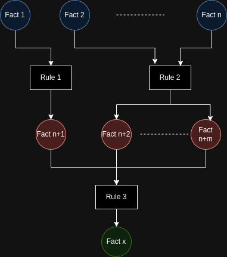
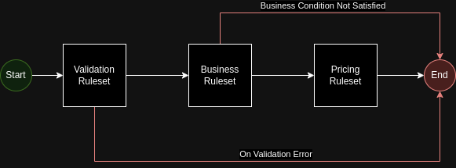
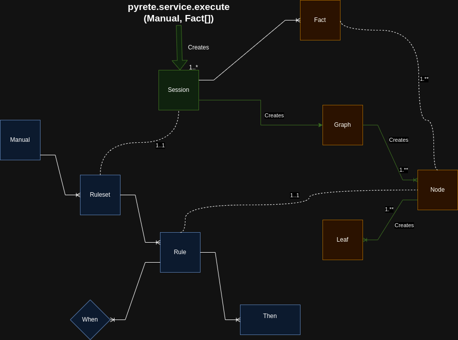

# Pyrete Concepts
This document documents the underlying concepts that are used to construct this project. These concepts are not just implementation details, but are essential for application developers who are using or planning to use this library. **So, it is important for application developers to read this document closely**.

Pyrete is a Python Language software library that enables application developers to build applications that make complex decisions based on **facts** supplied to the entrypoint (or **service**) and **rules** developed by **application developers** and **business users**. The individuals or groups that create the rules are referred to as **authors". 

At a high level, the service can be denoted as:

> Set\<result_facts> = service(Set\<input_facts\>, Collection\<rules\>)  
  where:  
  - **result_facts** are output(s) returned by the execution of the Pyrete engine.  
  - **input_facts** are input(s) to the Pyrete engine.  
  - **rules** are the rules coded in Python language that are provided to the Pyrete engine and executed by the engine to produce the output.

## Rete
Pyrete is an adaptation of the Rete algorithm designed by **Charles L. Forgy** of Carnegie Melon University. It is an efficient pattern matching algorithm that is widely used in many AI systems including Expert Systems. Unlike some other fields of AI like Machine Learning (ML), the results the Rete algorithm produce are more predictable and explainable. It also requires no learning as the algorithm is rule-based, i.e., predefined by "experts". Similar comparison also applies to statistical algorithms that are based on probabilistic model. In applications, Rete is often applied after ML and other statistical algorithms have processed the input data; the results from these process being fed to the Rete algorithm for higher accuracy and explainability.

### Inferencing
A Rete execution emulates the process used by humans to come to a decision (or conclusion) based on facts presented to him/her/them. To make the decision, a person takes the facts provided to him/her and applies a set of well-established logic (or rules). For complex decision-making, applying a rule to a set of facts may produce intermediate facts that are then used as input to another set of rules. This process continues until the person reaches a decision. One can think of Rete execution as a network of rules that are applied to facts in a certain order. A very **simplistic** representation of the Rete network execution is shown below.



In the above diagram, the process starts at the top and ends at the bottom ,Note that the network shown above, is very **simplistic**. First, real-life decision making involves many facts and many rules. Secondly, a rule does not just insert new facts, it can also modify existing facts and/or delete a facts. On any change to the facts, the Rete execution flow may be modified and can even be moved backward to re-execute some of the earlier rules that were based on "incorrect" facts (assumptions). So, the network is *cyclical* and *recursive* in nature, recursing through the rules in order to reach a decision. Contrast this type of network with acyclic flows like DAG (directed acyclic graph), commonly used in data pipelines in data analytics and ETL applications.

For implementing an application that makes complex decisions, Rete networks are designed using one of the following strategies or a combination of them.

- **Forward Chaining**: In this type of implementations, the network starts with basic facts, applies rules to them to produce more "advanced" facts which are then used as inputs to additional rules and so on, until a decision is reached.
- **Backward Chaining**: In this type of implementations, the network uses the conclusions (or decisions) as input to the network and uses rules to eliminate one or more of the conclusions in order to reach a decision.

The Rete framework, like Pyrete, handles the sequencing of the rules and recursion through the network allowing rule authors focus on creating rules. A rule may be authored  in isolation and added to a Rete execution, the rules authors do not always have to understand the entire chain. 

### When to use Rete
Rete is not without it's own drawbacks. To start with, the algorithm is complex and authors need to understand how it works in order to design and develop rules that work efficiently and so that it does not produce incorrect results. When asked to adopt Rete for building applications, application developers often ask the question - *why can't I use standard  constructs available on programming languages for developing the business logic (**switch/case**, **if-else**, etc.)?* This is a valid question. In fact, most simple decision-making applications can be developed using standard constructs. Rete must be used only when the business process is very complex and evolving (or changing). For complex business logic, developing the application using standard constructs is likely to make the business logic very complex (spaghetti code) over time, difficult to maintain, difficult to train new people, and error-prone. Also, keep in mind that often, requirements start out simple and grow complex over time. Another point to note is that, if business users are designated to author rules, application architects must ensure that proper design is in place to catch inefficiencies that a (non-technical) business user may inadvertently introduce in the network. Most importantly, automated unit tests must be in place to test out the scenarios thoroughly before making the application generally-available.

## Definitions
The definitions, below, are used throughout this document and library. Note that they may not necessarily align with industry-standard terminologies.

### Service 
A service is the Pyrete Rete engine endpoint. Pyrete provides a "**execute(...)***" function to trigger rule execution. An application may include multiple services for different types of decision making.  

### Facts
Facts are information that represent a "truth". Facts may have attributes that describe the characteristics of the fact. In Pyrete, facts are instances of a classes and the characteristics are variables of the class. For example: 

```python
    class Person():
        def __init__(self, gender, age):
            self.gender = gender
            self.age = age
```
Note that facts may also include classes provided by python standard libraries like list, set, tuple, dict, etc. Pyrete includes a set of container classes to facilitate rule creation that operates on a group of facts. These classes are covered in a separate document.

### FactSet
A FactSet include all the facts that are part of the current execution of rules. As mentioned above, new facts can be inserted to the Factset, facts can be deleted from the Factset or facts can be updated by rules during a Rete execution. 

### Rule
A rule is a set of conditions and an action that is performed when all the conditions are satisfied. The conditions are referred to as **When** or **Left Hand Side (LHS)** and the action is called as **Then** or **Right Hand Side (RHS)**. 

The action is a piece of Python code in the form of a function or a lambda. 

Each of the conditions need the following input parameters:
-  a **class**: specifies a class of facts the condition is interested in or operates on.
- a filter **expression**: a function or a lambda that returns either True or False. All the conditions must return True in order for the Then function to be executed. 

Normally, there is no need to specify the order in which the rules are executed because the Rete execution can figure that out. But it is possible to specify a run order and other hints to influence the execution. 

Pyrete provides library functions using which the Then function can insert, update and delete facts and functions that influence the Rete flow. It provides additional library functions that can be invoked from the Then expressions. These functions are covered in a separate document.

Here is an example of a simple rule definition:
```python
Rule(id='determine_if_adult',  
        when=[  
            Condition(for_type=Person, matches_exp=lambda ctx: ctx.this.age <21)  
        ],  
        then=lambda ctx: insert(Child(...)))  

    Rule(id='sell_alcohol_to_adults_only',  
        when=[  
            Condition(for_type=Child, matches_exp=lambda ctx: True)  
        ],  
        then=lambda ctx: insert(Sale(allow=False, ...)))
```

In the above example, Python *lambda expressions* are used. But references to functions may also be passed if the expressions are more complex. The insert() function, shown above, inserts a new fact into the FactSet.

### Ruleset
A ruleset is a collection of rules. For complex applications, the decision making process may require grouping the rules into rulesets and executing each ruleset in a specific flow. For example, rules may be classified in rulesets - validation rules, business rules and pricing rules. The requirement may be to run execute the rulesets in phases in the following manner.




With Pyrete, one can achieve that by classifying rules into rulesets and specifying the flow. Pyrete executes each ruleset in an **execution session**. On completion of a session, the facts from the output session are passed as inputs for the next session in the flow. A *Then* code on a rule in a ruleset can change the normal flow (shown using white arrows) by specifying which ruleset to execute next (show using red arrows). 

Example:
```python
Rule(id='end_execution', ruleset='validation_rules'  
        when=[  
            Condition(for_type=Validation, matches_exp=lambda ctx: not ctx.this.valid)  
        ],  
        then=lambda ctx: terminate())  
```

### Knowledge
A knowledge is a collection of rulesets. A knowledge is a repository of the entire rules for a particular decision-making service. A Pyrete service.execute(...) function executes the entire set of rules that is part of a knowledge instance. 

One way to view the Knowledge->Ruleset->Rule hierarchy is to consider it as a car owner's troubleshooting manual, with each chapter akin to ruleset and each section akin to rule; each section defining conditions to ascertain or derive some diagnosis.

The knowledge component includes static content - rulesets and rules, that are defined during the development cycle of a project by rule authors. When the application is started, the knowledge components are initialized either programmatically or via configuration as explained in later.

### Transaction
Once the knowledge contents are initialized, the application is ready to process incoming transactions. Incoming transactions can be received as a scheduled jobs or requests received from a message broker, web services requests, etc. Each transaction must include a set of facts and the knowledge component as input. On receiving the request, the ruleset is executed using the supplied facts. The output is a set of facts that are produced by the execution. A transaction can be denoted as follows:  

> Set\<result_facts> = service.execute(Set\<input_facts\>, Knowledge)  

The relationship between various entities involved in a Pyrete service is shown below:

#### What happens inside a transaction?
Please refer to the diagram below while reading this section.



The blue boxes represent the entities that are created during the development phase (or authoring phase). The runtime components are represented using green (service) and red (facts and other execution artifacts) boxes. As mentioned earlier, the **execute** function in the **service** module is the endpoint for initiating a transaction. 

The first step involves iterating through each ruleset and sequencing them for execution. For each ruleset, a **Session** is created. The session iterates through each rule of the ruleset and creates an execution graph. 